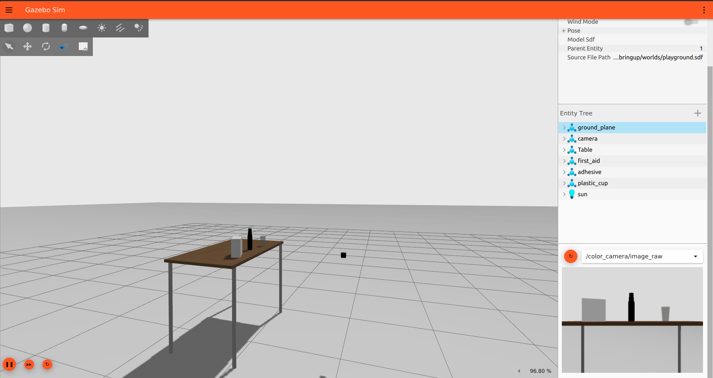
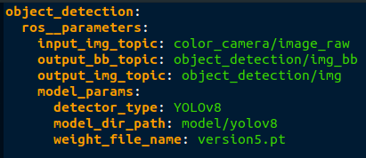

<!-- Improved compatibility of back to top link: See: https://github.com/othneildrew/Best-README-Template/pull/73 -->
<a name="readme-top"></a>
<!--
*** Thanks for checking out the Best-README-Template. If you have a suggestion
*** that would make this better, please fork the repo and create a pull request
*** or simply open an issue with the tag "enhancement".
*** Don't forget to give the project a star!
*** Thanks again! Now go create something AMAZING! :D
-->


<!-- PROJECT SHIELDS -->
<!--
*** I'm using markdown "reference style" links for readability.
*** Reference links are enclosed in brackets [ ] instead of parentheses ( ).
*** See the bottom of this document for the declaration of the reference variables
*** for contributors-url, forks-url, etc. This is an optional, concise syntax you may use.
*** https://www.markdownguide.org/basic-syntax/#reference-style-links
-->
[![Contributors][contributors-shield]][contributors-url]
[![Forks][forks-shield]][forks-url]
[![Stargazers][stars-shield]][stars-url]
[![Issues][issues-shield]][issues-url]
[![LinkedIn][linkedin-shield]][linkedin-url]


<!-- PROJECT LOGO -->
<br />
<div align="center">
  <a href="https://github.com/atom-robotics-lab/assets/blob/main/logo_1.png?raw=true">
    
  </a>

  <h3 align="center">ROS-Perception-Pipeline</h3>

  <p align="center">
    This repo is focused on developing a ROS 2 based perception-pipeline. 
    If you’re interested in helping to improve our Project</a>, find out how to <a href="https://github.com/atom-robotics-lab/ros-perception-pipeline/blob/main/contributing.md">contribute<a>.
    <br />
    <br />
    <br />
    <a href="https://github.com/atom-robotics-lab/ros-perception-pipeline/issues/new?labels=bug&assignees=jasmeet0915,topguns837,sanchayvashist,namikxgithub">Report Bug</a>
    ·
    <a href="https://github.com/atom-robotics-lab/ros-perception-pipeline/issues/new?labels=enhancement&assignees=jasmeet0915,topguns837,sanchayvashist,namikxgithub">Request Feature</a>
  </p>
</div>


<!-- TABLE OF CONTENTS -->
<details>
  <summary>Table of Contents</summary>
  <ol>
    <li>
      <a href="#about-the-project">About The Project</a>
      <ul>
        <li><a href="#built-with">Built With</a></li>
      </ul>
    </li>
    <li>
      <a href="#getting-started">Getting Started</a>
      <ul>
        <li><a href="#prerequisites">Prerequisites</a></li>
        <li><a href="#installation">Installation</a></li>
      </ul>
    </li>
    <li><a href="#usage">Usage</a>
        <ul>
        <li><a href="#testing">Testing</a></li>
      </ul>
    </li>
    <!--<li><a href="#roadmap">Roadmap</a></li>-->
    <li><a href="#contributing">Contributing</a></li>
    <li><a href="#license">License</a></li>
    <li><a href="#contact">Contact</a></li>
    <li><a href="#acknowledgments">Acknowledgments</a></li>
  </ol>
</details>


<!-- ABOUT THE PROJECT -->
## About The Project

Our aim is to build a one-stop solution to all the problems related to Robotics-Perception. We are creating a plug-and-play ROS 2 based perception-pipeline which can be customized
for user-specific custom tasks in the blink of an eye. We are in the process of creating different components for tasks like Object Detection, Image Pre-Processing, Image Segmentation etc.
These components can be stitched together to make a custom pipeline for any use-case, just like how we play with LEGO bricks.

<p align="right">(<a href="#readme-top">back to top</a>)</p>

### Built With

* [](https://www.sphinx-docs.org)
* [](https://opencv.org/)
* [](https://ubuntu.com/)
* [](https://www.python.org/)

<p align="right">(<a href="#readme-top">back to top</a>)</p>

<!-- GETTING STARTED -->
## Getting Started

Follow these steps to setup this project on your systm

### Prerequisites

Follow these steps to install ROS Humble and OpenCV
* ROS Humble
Refer to the official [ROS 2 installation guide](https://docs.ros.org/en/humble/Installation.html)

* OpenCV
  ```bash
  pip install opencv-contrib-python
  ```

### Installation

1. Make a new workspace
    ```bash
    mkdir -p percep_ws/src
    ```

2. Clone the ROS-Perception-Pipeline repository

    Now go ahead and clone this repository inside the "src" folder of the workspace you just created.

      ```bash
      cd percep_ws && git clone git@github.com:atom-robotics-lab/ros-perception-pipeline.git src/
      ```
3. Install dependencies using rosdep

    Update Your rosdep before installation.

    ```bash
    rosdep update
    ```
      
    This command installs all the packages that the packages in your catkin workspace depend upon but are missing on your computer.
    ```bash
    rosdep install --from-paths src --ignore-src -r -y
    ```

4. Compile the package

    Follow this execution to compile your ROS 2 package
  
      ```bash
      colcon build --symlink-install
      ```

5. Source your workspace
     
      ```bash
      source install/local_setup.bash
      ```


<!-- USAGE EXAMPLES -->
## Usage

<br>

### 1. Launch the Playground simulation
We have made a demo playground world to test our pipeline. To launch this world, follow the steps 
given below

```bash
ros2 launch perception_bringup playground.launch.py 
```
The above command will launch the playground world as shown below :


<br>

Don't forget to click on the **play** button on the bottom left corner of the Ignition Gazebo window

<br>

### 2. Launch the Object Detection node
<br>

Use the pip install command as shown below to install the required packages.
```bash
pip install -r src/ros-perception-pipeline/object_detection/requirements.txt
```

Use the command given below to run the ObjectDetection node. Remember to change the path of the object_detection.yaml
file according to your present working directory

```bash 
ros2 run object_detection ObjectDetection --ros-args --params-file src/ros-perception-pipeline/object_detection/config/object_detection.yaml
```

**Note :** If your imports are not working while using a virtual environment, you'll need to manually set your `PYTHONPATH` environment variable.
Follow these steps to do this :

1. Activate your virtual environment

2. Find out the path of your virtual environment's Python installation
    ```bash
    which Python
    ```

3. Set your `PYTHONPATH`
    ```bash
    export PYTHONPATH = {insert_your_python_path_here}
    ```


### 3. Changing the Detector


To change the object detector being used, you can change the parameters inside the object_detection.yaml file location inside 
the **config** folder. 


<br>

## Testing

Now to see the inference results, open a new terminal and enter the given command

```bash
ros2 run rqt_image_view rqt_image_view
```


<br>
<p align="right">(<a href="#readme-top">back to top</a>)</p>

### Run using Docker

1. Refer [here](https://docs.docker.com/engine/install/) to install Docker

2. Build/Start the docker container

      ```bash
      cd docker_scripts/run_scripts
      ./run_dev.sh
      ```

<!-- ROADMAP 
## Roadmap

- [x] Alpha version
- [x] Version 1
    - [x] Adding camera
    - [x] Adding 3d camera
    - [ ] Hardware prototype

See the [open issues](https://github.com/atom-robotics-lab/MR-Robot/issues) for a full list of proposed features (and known issues).

<p align="right">(<a href="#readme-top">back to top</a>)</p>

ROADMAP ?? -->


<!-- CONTRIBUTING -->
## Contributing

Contributions are what make the open-source community such an amazing place to learn, inspire, and create. Any contributions you make are **greatly appreciated**.

1. Fork the Project
2. Create your Feature Branch (`git checkout -b feature/AmazingFeature`)
3. Commit your Changes (`git commit -m 'Add some AmazingFeature'`)
4. Push to the Branch (`git push origin feature/AmazingFeature`)
5. Open a Pull Request

<p align="right">(<a href="#readme-top">back to top</a>)</p>

<!-- LICENSE -->
## License

Distributed under the MIT License. See `LICENSE` for more information.

<br />

<!-- CONTACT -->
## Contact

Our Socials - [Linktree](https://linktr.ee/atomlabs) - atom@inventati.org

<p align="right">(<a href="#readme-top">back to top</a>)</p>

<!-- ACKNOWLEDGMENTS -->
## Acknowledgments

* [Our wiki](https://atom-robotics-lab.github.io/wiki)
* [ROS Official Documentation](http://wiki.ros.org/Documentation)
* [Opencv Official Documentation](https://docs.opencv.org/4.x/)
* [Rviz Documentation](http://wiki.ros.org/rviz)
* [Gazebo Tutorials](https://classic.gazebosim.org/tutorials)
* [Ubuntu Installation guide](https://ubuntu.com/tutorials/install-ubuntu-desktop#1-overview)

<p align="right">(<a href="#readme-top">back to top</a>)</p>


<!-- MARKDOWN LINKS & IMAGES -->
<!-- https://www.markdownguide.org/basic-syntax/#reference-style-links -->
[contributors-shield]: https://img.shields.io/github/contributors/atom-robotics-lab/ros-perception-pipeline.svg?style=for-the-badge
[contributors-url]: https://github.com/atom-robotics-lab/ros-perception-pipeline/graphs/contributors
[forks-shield]: https://img.shields.io/github/forks/atom-robotics-lab/ros-perception-pipeline.svg?style=for-the-badge
[forks-url]: https://github.com/atom-robotics-lab/ros-perception-pipeline/network/members
[stars-shield]: https://img.shields.io/github/stars/atom-robotics-lab/ros-perception-pipeline.svg?style=for-the-badge
[stars-url]: https://github.com/atom-robotics-lab/ros-perception-pipeline/stargazers
[issues-shield]: https://img.shields.io/github/issues/atom-robotics-lab/ros-perception-pipeline.svg?style=for-the-badge
[issues-url]: https://github.com/atom-robotics-lab/ros-perception-pipeline/issues
[linkedin-shield]: https://img.shields.io/badge/-LinkedIn-black.svg?style=for-the-badge&logo=linkedin&colorB=555
[linkedin-url]: https://www.linkedin.com/company/a-t-o-m-robotics-lab/